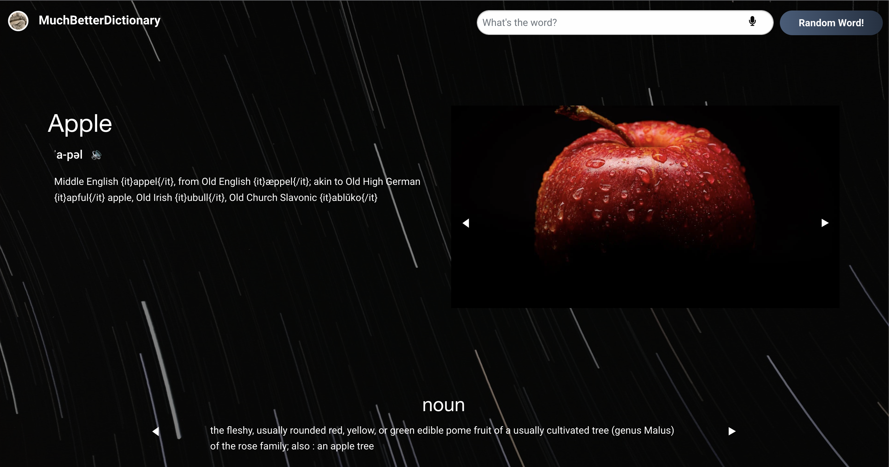
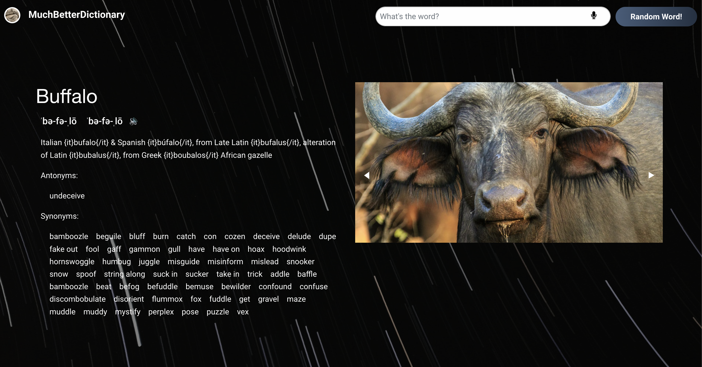

# Project 1 | Group 4 - MuchBetterDictionary

## Columbia University Bootcamp - Interactive Front-End Project: MuchBetterDictionary

> This repository contains our dictionary application that allows users to search and learn new words that they are unfamiliar with.

> Live Site: https://muchbetterdictionary.github.io/MuchBetterDictionary/
<<<<<<< HEAD
=======
> Live site: https://6257516db493d936abf49dc1--beamish-pixie-e11523.netlify.app/
>>>>>>> 067608788505360184a458a1b68a09a8766e94b0

## Table of Contents

- [General Info](#general-information)
- [Project Requirements](#project-requirements)
- [Looking ahead](#future-development)
- [Screenshots](#screenshots)
- [Contact](#contact)

## General Information

This repository contains our new and improved dictionary application that allows users to search and learn new words they are unfamiliar with through visual context, various definitions by part of speech, synonyms & antonyms, and the word origin. Users will also be able to search random words with a click of a button to learn quirky words they might not have ever considered searching for.

## Technologies Used:

- HTML
- CSS
- Bootstrap CSS Framework
- Foundations CSS Framework
- JQuery Library
- Axios
- Javascript

## Project Requirements:

Requirements:

<<<<<<< HEAD
- ✅ Use a CSS framework other than Bootstrap.
- ✅ Be deployed to GitHub Pages.
- ✅ Be interactive (i.e: accept and respond to user input).
- ✅ Use at least two server-side APIs.
- ✅ Does not use alerts, confirms, or prompts (use modals). **Our speech recognition function does have a microphone access prompt, as built-in by the web browser.**
- ✅ Use client-side storage to store persistent data.
- ✅ Be responsive.
- ✅ Have a polished UI.
- ✅ Have a clean repository that meets quality coding standards (file structure, naming conventions, follows best practices for class/id-naming conventions, indentation, quality comments, etc.).
- ✅ Have a quality README (with unique name, description, technologies used, screenshot, and link to deployed application).

> User Story:
=======
✅Use a CSS framework other than Bootstrap. 
✅Be deployed to GitHub Pages.
✅Be interactive (i.e: accept and respond to user input).
✅Use at least two server-side APIs.
✅Does not use alerts, confirms, or prompts (use modals).
*Our speech recognition function does have a microphone access prompt, as built-in by the web browser.
✅Use client-side storage to store persistent data.
✅Be responsive.
✅Have a polished UI.
✅Have a clean repository that meets quality coding standards (file structure, naming conventions, follows best practices for class/id-naming conventions, indentation, quality comments, etc.).
✅Have a quality README (with unique name, description, technologies used, screenshot, and link to deployed application).
>>>>>>> 067608788505360184a458a1b68a09a8766e94b0

> User Story:
```
AS A second language learner
I WANT a website/application that helps me bring context to words
SO THAT I can better learn new words that I am unfamiliar with.
```

> Acceptance Criteria:

```
GIVEN I need to learn the meaning of a new word
WHEN I browse to the website/application
THEN I am able to search for my own word or a random word

GIVEN some words are encountered through speech, and some through reading text
WHEN I attempt to learn about a given word
THEN I can either search through spelling the word OR saying aloud the word

GIVEN my spelling of pronounciation may be incorrect
WHEN my search entry is erroneous
THEN I am given suggestions as to the word I am looking for

GIVEN I want to fully understand and contextualize words
WHEN I search for a word
THEN I am presented with multiple dictionary entries
THEN I am presented with definitions(s) of the word
THEN I am presented with part(s) of speech of the word
THEN I can see the origin(s)/etymology(s) of the word
THEN I can see synonyms and antonyms of the word
THEN I can hear the pronounciation of the word
THEN I can see images of the word

GIVEN that traditional dictionaries are dull and difficult to navigate
WHEN I am presented with search results
THEN I am engaged by a pleasing and approachable layout

GIVEN I will use different devices to find word meanings
WHEN I use a tablet or mobile device
THEN The layout is adjusted to maintain a pleasing format

GIVEN I may want to revisit previously looked up words
WHEN I scroll to the bottom of the page
THEN I am presented with my recent searches

```

## Future Development

- A mobile app that is independent of being on a browser
- Tailor search results depending on location, so most useful definitions and pictures are displayed
<<<<<<< HEAD
  (e.g. a search for 'breakfast' would display typical breakfast foods in your country of search)
=======
(e.g. a search for 'breakfast' would display typical breakfast foods in your country of search)
>>>>>>> 067608788505360184a458a1b68a09a8766e94b0
- Add more dictionary API's, such as translation dictionaries, medical/ scientific dictionaries and urban dictionaries
- Approach language-instruction and language-study companies for collaboration

## Screenshots





## Contact

Created by:

- Jessica Chen | jessicachen28@gmail.com
- Branden Medary | branden.medary@gmail.com
- Maame Sekyere | maameant@gmail.com
- Ross Thomson | rthomson412@gmail.com
